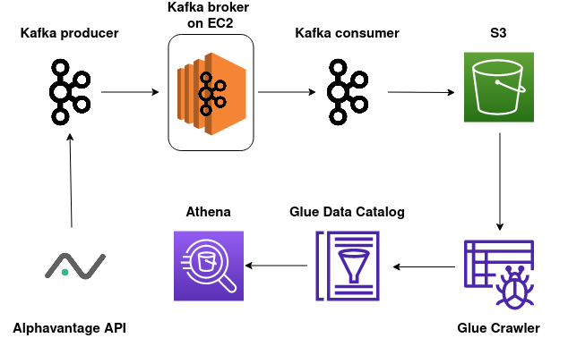

# kafka-stock-market-aws
A small proof-of-concept project that retrieves stock market data from the AlphaVantage API, sends it to a Kafka producer/consumer setup, stores it in AWS S3 and enables AWS Athena to analyze it through SQL.

## Kafka setup

1. Create an EC2 instance on AWS and edit the security group options such that the rules include all traffic from your local machine's IP and the public IP of the EC2 instance. You can also allow all traffic from any IP, although that is considered bad practice.

2. Install Java

```bash
sudo yum install java-1.8.0-amazon-corretto
java -version
```

3. Download Kafka 

```bash
wget https://downloads.apache.org/kafka/3.3.1/kafka_2.12-3.4.1.tgz
tar -xvf kafka_2.12-3.4.1.tgz
```

4. Start Apache Zookeeper 

```bash
bin/zookeeper-server-start.sh config/zookeeper.properties
```

5. Change ```server.properties``` configuration 

The EC2 instance is private by default, so ```server.properties``` has to be edited so that it can run on a public IP address. To do this, edit the ```ADVERTISED_LISTENERS``` line in the ```config/server.properties``` file and plug in the public IP address of the EC2 instance.

6. Start Apache Kafka broker/server

```bash
export KAFKA_HEAP_OPTS="-Xmx256M -Xms128M"
cd kafka_2.12-3.4.1
bin/kafka-server-start.sh config/server.properties
```

7. Create a topic

```bash
cd kafka_2.12-3.4.1
bin/kafka-topics.sh --create --topic mytopic --bootstrap-server 1.2.3.4:9092 --replication-factor 1 --partitions 1
```

8. Start the producer

```bash
bin/kafka-console-producer.sh --topic mytopic --bootstrap-server 1.2.3.4:9092 
```

9. Start the consumer

```bash
cd kafka_2.12-3.4.1
bin/kafka-console-consumer.sh --topic mytopic --bootstrap-server 1.2.3.4:9092
```

## Diagram



- AWS S3 &rarr; stores object data in buckets
- AWS Glue Crawler &rarr; scans and discovers the structure, schema, and format of data stored in various data sources like Amazon S3, Amazon RDS, and more. It creates metadata tables in the AWS Glue Data Catalog, facilitating data integration and making it easier to use and process the data in AWS Glue ETL jobs, AWS Athena queries, and other AWS services
- AWS Glue Data Catalog &rarr; acts as a centralized catalog for storing and organizing metadata about data sources, tables, and schemas
- AWS Athena &rarr; a serverless query service that enables users to run ad-hoc SQL queries on data stored in Amazon S3

## Resources

- [Kafka Topics CLI tutorial](https://www.conduktor.io/kafka/kafka-topics-cli-tutorial/) 
